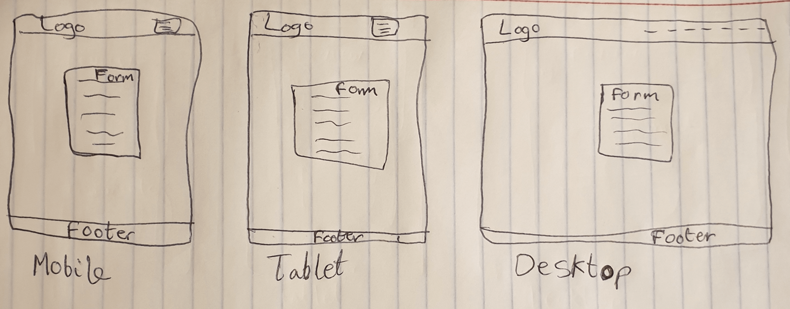

# [L2D DRIVING SCHOOL CI PP4](https://l2d-driving-school-6f23811ec0fb.herokuapp.com)

## Introduction

Introducing L2D Driving School — a groundbreaking prototype within the driving education landscape. The website is aptly named "L2D Driving School", with "L2D" representing the abbreviation for "learn-to-drive." This concise moniker encapsulates the platform's primary mission — to facilitate the journey of learners as they master the art of driving.

This innovative full-stack website serves as a digital platform for a freelance driving instructor to showcase her services, while offering students a seamless experience to find, book and review driving lessons. L2D Driving School not only streamlines the process of booking driving lessons but also fosters community engagement through its interactive platform, where students can share experiences, exchange insights and potentially build connections with fellow learners. This interactive element enhances the learning process and also creates a sense of camaraderie among users, fostering a supportive environment for skill development.

With its sleek design and intuitive interface, the website offers users a glimpse into what a fully established version could offer. From the moment users land on the home page, they are greeted with a seamless browsing experience, navigating effortlessly through authentication pages, profile creation and appointment scheduling.

In future iterations, L2D Driving School plans to further enhance community engagement and accessibility by integrating social media links. These additions will enable users to connect with the platform's vibrant community across various social channels, further fostering discussions, sharing experiences and expanding the reach of the driving education ecosystem.

You can access the application [here](https://l2d-driving-school-6f23811ec0fb.herokuapp.com).


## User Experience

The genesis of this project stemmed from the ambition of a driving instructor, currently affiliated with an agency, who aspires to transition into a freelance role, managing her own clientele. The inception of the website began with an extensive brainstorming session to delineate the essential information required to captivate potential clients. Subsequently, wireframes were crafted to provide a preliminary visualisation of the website's layout and structure. It's important to note that these wireframes serve as a blueprint and are subject to refinement and adaptation as the project progresses.

One of the primary considerations was the establishment of a colour scheme that exudes professionalism and authenticity, setting the tone for the overall aesthetic. Following this, the project was initiated with the configuration of fundamental settings. The backend development ensued, focusing on pivotal functionalities such as database setup and implementing CRUD (Create, Read, Update, Delete) operations. Concurrently, attention was directed towards enhancing the frontend to ensure an optimal user experience (UX). This iterative process underscores the dynamic nature of the project, allowing for the exploration of new ideas and the possibility of discarding existing ones as the development journey unfolds.

The project's journey further delved into the realm of database management and user interaction. While the foundation was laid with CRUD operations, tailored specifically for user profiles, reviews, and comments, a deliberate decision was made regarding the absence of CRUD functionalities for appointment scheduling. This choice was informed by the recognition of existing web applications with robust appointment scheduling capabilities, surpassing the project's scope and functionality. Instead, the focus pivoted towards refining the user experience, streamlining navigation, and ensuring seamless interaction with essential features like user profiles, reviews, and comments. This strategic alignment allowed for a more efficient allocation of resources, maximizing the project's impact within its defined boundaries. As the iterative process unfolded, this conscious decision fostered agility and adaptability, facilitating the incorporation of new ideas and refinements to better serve the project's objectives.

### Colour Scheme


The carefully curated colour scheme for this website has been meticulously selected to convey an aura of professionalism and authenticity. The predominant use of pristine white (#fff) exudes cleanliness and clarity, making it ideal for elements such as cards, forms, and the navbar, ensuring that essential information is easily discernible. The subtle shade of #e6e6e9 serves as a backdrop, enhancing readability and providing a sense of coherence across backgrounds, form fields, and text areas. Bold black (#000) is employed for text and headings, instilling a sense of authority and clarity in communication, while judiciously applied opacity imbues date stamps and pending reviews/comments with a hint of gravitas. Striking shades of #7DAEF8 and #1146F5 are strategically utilised for buttons, logos, navigation links and contact information, injecting vibrancy and professionalism into the interface. Finally, the assertive hue of #ff8f8f serves as a visual cue for actions involving deletions, cancellations, or clearances, ensuring intuitive user interactions. Collectively, these colours harmonise to create a visually appealing and trustworthy platform for both clients and the driving instructor alike.


### Typography

* ["Montserrat"](https://fonts.google.com/specimen/Montserrat) is the font used for headings with a fallback of the font-stack 'Arial, Helvetica, sans-serif'. Montserrat is a modern and clean sans-serif font that offers a professional and easy-to-read appearance. Its versatility and geometric design make it suitable for headings and titles.
* ["Noto Sans"](https://fonts.google.com/noto/specimen/Noto+Sans) is the font used for the body text with a fallback of the font-stack 'Arial, Helvetica, sans-serif'. Noto Sans is a clean and neutral sans-serif font that provides good readability for body text. Its simplicity and wide character support make it suitable for conveying information in a clear and professional manner.

The combination of Montserrat for headings and Noto Sans for body text offers a well-balanced and professional aesthetic for a driving school website. The pairing achieves a harmonious contrast, with Montserrat's bold and modern design providing distinction for headings, while Noto Sans ensures optimal readability in body text. The fonts share a clean and contemporary style, fostering consistency and a unified look throughout the website. Their versatility allows for adaptability in different design elements, while Noto Sans' extensive character support promotes accessibility for a diverse audience. Overall, this font pairing creates a visually appealing and credible online presence for the driving school.

[Font Awesome](https://fontawesome.com) icons were used throughout the site - on the github footer link, on the contact page and on the review cards.

### User Stories

**User Account Management and Authentication:**

This epic focuses on the foundational aspects of user management and authentication, ensuring users can securely access the platform. It includes functionalities such as logging in, logging out, password reset and user registration.

* Sign up - As a new site user I can register and establish an account on the site so that I can create a personalised profile. ***(MUST HAVE)***
* Log in - As a registered user I can log in to my account to actively participate in the site's community, engaging with reviews and managing my appointments so that I can enhance my user experience and stay organised with scheduled appointments. ***(MUST HAVE)***
* Log out - As a registered user I can log out of my account so that I can end my session on my current device. ***(MUST HAVE)***
* Password reset - As a registered user/site admin I can reset my password if I forget it so that I can regain access to my account. ***(COULD HAVE)***
* View my profile details - As a registered user I can view my profile details so that I can see the personal information I have provided. ***(MUST HAVE)***
* Update my profile - As a registered user I can customise my profile settings so that I can tailor my online experience to reflect my personality. ***(MUST HAVE)***
* Delete my account - As a registered user I can delete my account so that my personal information and account data are permanently removed from the system. ***(COULD HAVE)***

**User Engagement and Community Discovery:**

This epic focuses on enhancing user engagement and fostering a sense of community within the platform. It includes features that enable users to explore members of the community.

* Explore user gallery - As a site user, I can browse a paginated gallery of other users so that I can discover fellow members of the platform community. ***(COULD HAVE)***
* View other user profiles - As a site user, I can view other user profiles so that I can learn more about their background and offerings, which helps me make informed decisions when engaging with their content. ***(COULD HAVE)***

**Interactive Reviews:**

The Content Interaction epic revolves around user engagement with platform content. It allows users to create new posts with a rating and also includes features like editing, viewing and deleting posts, as well as liking and commenting on posts. Users can also manage their own comments and view comments from others on their posts.

* Create a new review - As a registered user I can create a new review which provides a rating and a description so that I can share my experience and contribute valuable feedback to the community. ***(MUST HAVE)***
* Read an existing review - As a site user I can access and read the full content of an individual review so that I can stay informed about the discussions and experiences shared within the community. ***(MUST HAVE)***
* Edit my review - As a registered user I can edit my reviews so that I can refine and update my thoughts and feedback as needed. ***(MUST HAVE)***
* Delete my review - As a registered user I can delete my own reviews so that I have control over the content I contribute to the community. ***(MUST HAVE)***
* Review timestamp visibility - As a site user I can view the timestamp of a review so that I can understand the context and relevance of the content based on its creation time and date. ***(SHOULD HAVE)***
* Review edit timestamp visibility - As a site user I can view the timestamp of a review that has been edited so that I can track when changes were made and assess the credibility and relevance of the review's content over time. ***(COULD HAVE)***
* Like reviews - As a registered user I can like another person's review so that I can let them know I appreciate their post. ***(COULD HAVE)***
* Unlike reviews - As a registered user I can unlike reviews so that I can adjust my preferences and ensure the accuracy of my endorsements. ***(COULD HAVE)***
* Comment on reviews - As a registered user I can comment on existing reviews so that I can actively engage with other members who have shared their experience. ***(SHOULD HAVE)***
* View comments on reviews - As a site user I can access comments on reviews by simply clicking on the respective review so that I can engage with and further explore the insights and discussions within the community. ***(SHOULD HAVE)***
* Update own comments on reviews - As a registered user I can edit my comments on reviews that I have previously made so that I can keep my contributions up-to-date and relevant. ***(SHOULD HAVE)***
* Delete own comments on reviews - As a registered user I can delete my comments on another person's review as well as my own so that I can manage and control the content associated with my profile, removing comments as needed for relevance or appropriateness. ***(SHOULD HAVE)***
* Comment timestamp visibility - As a site user I can view the timestamp of a comment so that I can understand the context and relevance of the content based on its creation time and date. ***(COULD HAVE)***
* Notification alerts for interaction - As a registered user I can receive notifications for likes, comments and mentions on my reviews so that I can stay informed and promptly engage with the community's responses to my content. ***(WON'T HAVE)***

**Appointments:**

This epic encompasses the management of appointments. Users can view and interact with the appointments panel in order to view, book, edit and delete their appointments.

* Book appointments - As a registered user I can schedule a new driving lesson by selecting a preferred time and date so that I can efficiently plan and manage my appointments with the driving instructor. ***(MUST HAVE)***
* View my appointments - As a registered user I can view a list of my scheduled appointments so that I can keep track of my upcoming driving lessons and manage my time effectively. ***(MUST HAVE)***
* Edit my booking - As a registered user I can edit the details of my booked appointment so that I can make necessary adjustments to the time or date, ensuring my driving lessons align with my schedule. ***(MUST HAVE)***
* Delete my appointment - As a registered user I can delete a scheduled appointment so that I can remove appointments that are no longer needed, ensuring an accurate and up-to-date schedule. ***(MUST HAVE)***

**Content Moderation and Review**

Content Moderation and Review involve features for administrators to monitor and manage the content on the platform. This includes reviewing flagged posts, moderating inappropriate content, and ensuring a safe and respectful community environment.

* Content moderation - As a site administrator I can delete/update/approve reviews and comments from any user so that I can maintain the integrity of the platform. ***(MUST HAVE)***
  
**User Experience and Design**

This epic is dedicated to creating an intuitive and visually appealing user experience. It covers the design aspects of the website, ensuring clarity, ease of use, and a positive overall user experience.

* Navigation - As a new site user I can navigate through the interface effortlessly so that I can quickly and easily find the information I need. ***(MUST HAVE)***
* Website clarity - As a new site user I can comprehend the website's purpose at a glance so that I can determine if the platform aligns with my needs and interests. ***(MUST HAVE)***
* Driving instructor details - As a site user I can read about the driving instructor so that I can learn about their experience and teaching approach, helping me make informed decisions about booking driving lessons. ***(SHOULD HAVE)***
* Instructor ratings overview - As a new site user I can view the driving instructor's experience and ratings so that I can make an informed decision about choosing a qualified and well-rated instructor for my driving lessons. ***(SHOULD HAVE)***
* View paginated list of reviews - As a a site user I can view a paginated list of reviews so that I can select which review I want to view in more detail. ***(MUST HAVE)***
* Theme customisation - As a site user I can customise the theme and appearance of the website so that it suits my preferences. ***(WON'T HAVE)***
* Contact information - As a new site user I can easily find and access the driving instructor's contact information so that I can get in touch for inquiries or assistance. ***(MUST HAVE)***

These epics collectively represent the core functionalities and user experiences that your platform offers. They provide a high-level overview of the different aspects users and administrators can interact with on the platform.


## Wireframes

<details>
<summary> Click here to see the HOME page wireframes </summary>

  - 

</details>
<details>	
<summary> Click here to see the REVIEWS page wireframes </summary>

  - 

</details>
<details>	
<summary> Click here to see the APPOINTMENTS page wireframes </summary>

  - 

</details>
<details>	
<summary> Click here to see the PROFILE page and USER PROFILE page wireframes </summary>

  - 

</details>
<details>	
<summary> Click here to see the ALL USERS page wireframes </summary>

  - 

</details>
<details>	
<summary> Click here to see the CONTACT page wireframes </summary>

  - 

</details>
<details>	
<summary> Click here to see the SIGN UP page, LOGIN page and various password reset page wireframes </summary>

  - 

</details>
<details>	
<summary> Click here to see the EDIT PROFILE page wireframes </summary>

  - 

</details>
<details>	
<summary> Click here to see the REVIEW FORM page and EDIT REVIEW page wireframes </summary>

  - 

</details>
<details>	
<summary> Click here to see the REVIEW DETAILS page (contains comment form) and EDIT COMMENTS page wireframes </summary>

  - 

</details>

## Features

### Current features

* Navbar
  	* The navigation bar on all pages features a collapsible menu for smaller screens and includes the platform's logo with clickable text to return to the home page. Clickable links are provided for easy access to different pages, while the authentication button 	dynamically displays options based on the user's authentication status: "Login/Sign up" for unauthenticated users and "Logout" for authenticated ones.
  	* Active links are visually distinguished on the website to indicate the current page. They are highlighted by emboldening the text and adding a border around the particular link (this border is not present on smaller screens), ensuring clear navigation and 	providing users with a visual cue of their current location within the site.
  	* The navigation bar items on the website feature hover effects to enhance user interaction and UX. When hovered over, the logo, logo text, and links lighten to provide visual feedback. Additionally, the authentication button exhibits a glow effect upon hover, 	further enhancing the interactive experience and guiding user actions.
  	* Authenticated users gain access to additional navigation links, while the "Appointments" link is dynamically included once their profile is approved by the admin. This not only provides users with a personalised experience but also safeguards against misuse 	by ensuring that appointment booking privileges are granted only to verified users.


* Footer
	* The footer block appears on all pages, displaying copyright information for the website and its author. Additionally, it features a distinctive spinning animation applied to the GitHub logo, inviting users to explore the project's repository on GitHub.


* Home page
	* The home page features a captivating first-person view from the driver's seat, depicting a car journey on a bustling motorway. This immersive visual immediately communicates the central theme of the website: driving.
	* After 3 seconds, an overlay gracefully emerges atop the image, presenting a user-friendly prompt box with a title (the website brand) designed to engage the visitor. Depending on the user's authentication status, distinct call-to-action buttons are displayed. 	If the user is not authenticated, the left button prompts them to sign up. If the user is authenticated, the button directs them to explore reviews. For authenticated users whose profiles are approved, the button facilitates scheduling appointments. This 		feature is useful because it provides a clear and concise call to action tailored to the user's authentication status. By presenting different options based on whether the user is authenticated and if their profile is approved, the website streamlines the user 	experience and guides them towards relevant actions. This personalised approach helps users easily navigate the site and encourages them to take specific actions based on their current status, ultimately improving user engagement and conversion rates.


* Blue buttons
	* The website predominantly uses blue-coloured buttons, which feature an aesthetically pleasing hover effect causing them to darken when interacted with. Having a consistent colour scheme and hover effect for buttons enhances the visual appeal of the website 	and provides a cohesive user experience. When users interact with buttons, the subtle change in colour helps indicate that the button is interactive, improving usability and guiding user behavior. This visual feedback can contribute to a more intuitive and 	engaging interface, ultimately enhancing the overall user experience.


* Django messages
	* Django messages are displayed prominently at the top of the page following user actions, such as logging in or submitting content. This feature ensures that users receive immediate feedback regarding the success/failure of their interactions with the 		website, contributing to a seamless and intuitive user experience.
	* The Django messages have been tailored to enhance user experience by employing a customised design. These messages gracefully fade out after 5 seconds, ensuring a non-intrusive display. Positioned directly beneath the navigation bar using absolute 		positioning, they seamlessly integrate into the page layout without disrupting the user's browsing flow. This approach not only prioritizes aesthetics but also maintains the page's overall cohesion and usability.
   


* Reviews page
	* The reviews page is structured into two main sections: an "about me" segment introducing the driving instructor and a reviews section. The "about me" section serves as a vital introduction to the driving instructor, providing potential clients with essential 	information about their background, experience, teaching approach and any other pertinent details. Additionally, the "about me" segment can help establish trust and rapport between the instructor and prospective clients, fostering a sense of connection and 	confidence in their abilities. Overall, including an "about me" section enhances transparency, allows for better informed decision-making, and contributes to a positive user experience on the website. In the reviews section, users are greeted with an 		introductory paragraph followed by the average rating derived from all reviews. A paginated list of reviews is then presented where each review is presented in a card format, featuring key details such as the review author, rating, number of likes and comments 	on the review, along with a snippet of the review content. This layout offers users a comprehensive overview of the driving instructor's profile and feedback from previous clients.
 	* The hover effect on the review cards adds a visually appealing touch to the user interface, enhancing the interactivity and engagement of the reviews section. When users hover over a review card, the subtle shine effect creates the illusion the card's surface 	catching light, drawing attention to it and signaling interactivity. This effect not only adds a touch of realism and dynamism to the design but also provides users with visual feedback, indicating that the card is interactive and inviting them to explore 	further. Overall, the hover effect contributes to a more immersive and enjoyable user experience on the website.
	* The pagination buttons are designed to resemble blue buttons, with a consistent hover effect that signals their interactivity. When clicked, active pagination buttons retain their dark blue colour, ensuring clarity in user navigation and interaction.


* All users page
	* The "All Users" page features a search bar at the top, allowing users to easily search for specific users. Below the search bar, there is a paginated gallery displaying users, with 12 users shown per page for optimal browsing experience.
 	* The user gallery thumbnails exhibit a hover effect that enhances their opacity and slightly enlarges the thumbnail, providing a visual indication of interactivity when users hover over them.
 


* Contact page
	* The contact page is composed of a user-friendly contact form designed for inquiries, accompanied by a concise contact information card. This card contains essential details such as the venue address, contact number, email address, and a Google Maps image 	providing users with clear and accessible means of communication.


* All forms
	* When users interact with the form fields throughout the website, they become highlighted with a dark blue color, indicating that the field is currently in focus. Highlighting form fields when focused provides clear visual feedback to users, making it easier 	for them to identify the active field and input their information accurately.


* Authentication page
	* The template background depicts a scenic landscape featuring a lengthy road winding through mountainous terrain. This imagery is metaphorically intended to symbolize the journey of learning to drive and the progression towards mastering the skill. The 		expansive road stretching into the distance evokes a sense of exploration and adventure, mirroring the experience of embarking on the road to becoming a confident driver. This thematic backdrop not only adds visual appeal to the website but also conveys the 	essence of the driving experience, creating a cohesive and immersive environment for visitors.
	* Upon successful login or signup, users are redirected to the home page, ensuring a smooth transition and immediate access to the platform's content and features. This functionality enhances user experience by eliminating unnecessary steps and providing quick 	access to the main interface, thereby improving usability and user satisfaction.

* Authentication page - Log in form
    	* When accessing the login page, users who are not authenticated can do so by clicking the authentication button labeled "Login/Sign up" located within the navbar.
	* The login page features essential form fields for entering a username and password. Users must accurately input their credentials to successfully access their account.
	* The "Forgot your password?" link serves as a valuable feature by offering users a means to reset their password in case they forget it. This functionality prevents users from being permanently locked out of their accounts due to forgotten passwords, enhancing 	the overall user experience by providing a solution to a common issue encountered during login processes.
	* The "Login" button facilitates user authentication, granting access to their account upon successful verification of credentials. Meanwhile, the "Reset" button conveniently clears the form, allowing users to swiftly start anew if they wish to input different 	login details or cancel the login process altogether. These functionalities are crucial for providing users with a seamless and intuitive login experience, ensuring efficiency and ease of use when accessing their accounts.
	* The "Sign up here" link conveniently toggles the sign-up page, enabling users to transition to the registration process when they are not yet registered. This functionality is useful as it offers users a straightforward way to access the sign-up page 		directly from the login page, facilitating the process of creating a new account for those who have not yet registered.
	* Error messages are displayed directly on the form if users enter incorrect details. This immediate feedback mechanism allows users to quickly identify and rectify any mistakes, enhancing the overall usability of the form. By presenting errors in context, 	users can easily understand what went wrong and take corrective actions without the need for additional navigation or guesswork. This approach streamlines the user experience and promotes efficient form submission, ultimately reducing frustration and improving 	user satisfaction.


* Authentication page - Sign up form
	* The sign-up process includes validations to ensure data accuracy and security. It checks that the email address is unique, passwords match, and the chosen username is available. Additionally, all fields must be filled out to prevent incomplete submissions. 	These measures ensure a smooth and secure registration experience.
	* The "Sign up" button initiates the process of registering a new user and creating a new account in the database, enabling users to access more of the platform's features and services. Conversely, the "Reset" button provides a convenient way for users to clear 	the form, allowing them to start over if they need to revise their input or if they accidentally enter incorrect information. These features are useful as they streamline the user experience, facilitating smooth sign-up processes and reducing frustration 		associated with form errors or unwanted inputs.
	* The "Log in here" link conveniently toggles the login page, allowing users to transition to the login process when they are already registered. This functionality is useful as it provides users with a direct and accessible way to access the login page from 	other parts of the website, facilitating seamless access to their accounts for those who are already registered.
	* Similar to the login form, error messages are displayed if the criteria are not met during the sign-up process. Error messages during the sign-up process are useful as they provide feedback to users about the criteria they need to meet in order to 		successfully create an account. This helps users understand why their sign-up attempt failed and how they can rectify the issues to proceed with the sign-up process.


* Authentication page - Password reset request form
	* The password reset request form provides users with the ability to reset their password, contingent upon having a registered account. When an incorrect email is entered, no email is dispatched. Conversely, upon entering the correct email, an email containing 	a secure token for password reset is promptly dispatched to the user. For security measures, the token is only accessible during the current session. Additionally, feedback regarding the validity of an email is intentionally withheld to prevent potential 		security breaches.


* Authentication page - Password reset request confirmation
	* Upon entering an email, a message appears prompting the user to check their email for further instructions. This serves as a helpful reminder, ensuring users are aware of the next steps required to complete the password reset process. This guidance reduces 	confusion and streamlines the user experience, ultimately leading to a smoother password reset process.
	* After submitting the email, the user is instructed to check their email inbox for further instructions. This step ensures that users can securely verify their identity and proceed with the password reset process.


* Authentication page - Password reset form
	* Once the user clicks the link provided in the email, they are directed to the password reset form, which is connected with their registered account. This transition ensures a secure and streamlined process for users to reset their password without the need 	for manual input, enhancing user experience and minimising potential errors.
 	* The form includes a submit button, allowing users to finalise their password reset, and a clear button to remove any entered information. The submit button allows users to complete the password reset process, while the clear button enables them to easily 	remove entered information if needed, enhancing user control and flexibility.
	* The form also incorporates error messages to aid users in resolving any issues encountered during the password reset process. Error messages are integrated into the form to assist users in identifying and addressing any issues that may arise during the 		password reset process, thereby facilitating a smoother and more efficient user experience.


* Authentication page - Password reset complete
	* Upon successfully changing their password, users receive a confirmation message along with a direct link to log back into their account. This ensures users are promptly informed of the password change's success and provides convenient access to their account.


* Log out button
	* When users click the logout button, a modal dialog box appears, presenting them with options to either confirm or cancel the logout action. This approach enhances user experience by adding an extra layer of confirmation, reducing the likelihood of accidental 	logouts and ensuring users have control over their actions. By providing a clear and explicit confirmation step, users can make informed decisions and avoid unintended disruptions to their browsing experience.


* Red buttons
	* There are several red buttons strategically placed throughout the website, serving specific purposes such as canceling an action, confirming a deletion, or clearing a form. These buttons are intentionally colored red to signify their critical functions and 	encourage cautious interaction. Similar to the blue buttons, they also feature a hover effect that darkens the color, providing visual feedback to users upon interaction. This design choice ensures clarity and consistency in button behavior across the platform, 	enhancing the overall user experience.


* Appointments page
	* As reiterated, access to this section of the website is restricted to authenticated and approved users. This restriction ensures that only verified users can engage with privileged content. By limiting access to authenticated and approved users, the website 	can prevent unauthorised use.
	* Users can conveniently manage their appointments through an integrated Calendly application. This feature streamlines the scheduling process by providing users with a user-friendly interface to view, book, and manage their appointments directly on the 		website. By leveraging Calendly's functionality, users can easily find available time slots, schedule appointments, and receive automated reminders, enhancing the overall user experience and ensuring efficient appointment management.


* Profile page
	* The profile page provides users with a comprehensive overview of their account details and activities. Here, authenticated users can easily access and manage their profile information, including the option to edit or delete their profile. Additionally, users 	can conveniently add a review if they haven't already done so, or interact with their existing reviews by viewing, editing, or deleting them as needed. Furthermore, users have the ability to engage with comments on other users' reviews, allowing for seamless 	interaction and moderation within the platform. This centralised hub empowers users to control their online presence and contribute to the community in a meaningful way.
	* When users choose to edit their profile, they are directed to the user profile form, where they can update their personal information and preferences (email is read-only) with the option to save or cancel. This streamlined process ensures that users can 	easily make changes to their profiles without navigating through multiple pages or complex interfaces. By providing a user-friendly editing interface, the platform enhances user experience and encourages active engagement with profile customisation.
	* Upon selecting the option to delete their profile, users are presented with a modal dialog box that requests confirmation before proceeding with the deletion. This approach serves as a safeguard against accidental deletions, allowing users to reconsider their 	decision and providing an additional layer of security for account management. By incorporating this confirmation step, the platform mitigates the risk of unintentional profile deletions, ensuring that users have a chance to confirm their actions before 		permanent changes are made to their accounts.
 	* Users who haven't submitted a review yet are granted the option to provide feedback on the service. However, to prevent misuse or spamming, each user is limited to submitting only one review. This approach ensures that reviews are genuine and relevant, 		maintaining the integrity of the feedback system. By offering users the opportunity to share their experiences while implementing restrictions to prevent abuse, the platform fosters a trustworthy environment where genuine feedback is valued and meaningful.
	* Before approval by the admin, reviews remain unpublished and are displayed in a greyed-out format on the reviews page. These pending reviews are only accessible to the user who submitted them, viewable solely on their profile page. This approach ensures that 	only verified and appropriate reviews are showcased on the public reviews page, maintaining the quality and reliability of the content visible to other users. By subjecting reviews to admin approval before publication, the platform upholds standards of 		authenticity and relevance, fostering trust and credibility among users.
	* Displayed approved reviews feature comprehensive details including the review content, date of the review, the number of comments, likes and rating. Users are provided with convenient options to edit or delete their reviews directly from the profile page. 	This functionality enhances user engagement by offering an efficient way for users to manage their reviews, ensuring they can maintain the accuracy and relevance of their contributions over time. Additionally, it empowers users to maintain control over their 	content and fosters a sense of ownership within the platform community.
	* Users who have submitted reviews have the ability to access their reviews in detail, along with any associated comments, by selecting the "View details" option. This action redirects them to the review details page, offering a comprehensive overview of their 	contribution and any ensuing discussions. This functionality proves beneficial as it empowers users to monitor interactions and engage with feedback on their reviews, fostering a sense of ownership and accountability for their contributions to the platform's 	community.
	* When users choose to edit their reviews, they are presented with the review form, facilitating the process of refining and updating their feedback with the option to save or cancel. This functionality is valuable as it enables users to maintain the accuracy 	and relevance of their contributions over time. Additionally, it empowers users to reflect on their experiences and make necessary adjustments to their reviews, ensuring that their feedback remains informative and helpful to others in the community.
	* When users opt to delete their reviews, a modal window appears, offering them the choice to confirm or cancel the action. This feature serves as a safeguard, providing users with an opportunity to reconsider their decision before permanently removing their 	review. Additionally, it helps prevent accidental deletions and encourages users to take deliberate actions, ensuring the integrity and reliability of the content on the platform.
	* Initially, comments made by users are displayed in a greyed-out state and are only visible on the profile page of the respective user. This setup ensures that comments undergo moderation by an administrator before being publicly accessible, maintaining the 	quality and appropriateness of content across the platform. Additionally, comments awaiting approval do not appear on review details pages until they are vetted by an admin. If a user has not made any comments, their profile page remains unaltered, contributing 	to a streamlined and clutter-free user experience.
	* Approved comments prominently display essential information such as the author of the review being commented on, the date of the comment and the comment content. Users are provided with convenient buttons to edit or delete their comments directly from their 	profile page, offering them control over their contributions and fostering a sense of ownership within the platform community. This functionality enhances user engagement by facilitating seamless interaction with comments, allowing users to ensure the accuracy 	and relevance of their contributions over time.
	* Users have the option to edit their comments by utilising the "Edit Comment" button, which redirects them to the review details page housing the comment form with the option to save or cancel. This functionality empowers users to modify their comments as 	needed, enhancing their ability to accurately express their opinions and thoughts on the platform.
	* Selecting the "Delete Comment" button triggers a modal that provides users with the choice to either proceed with deleting their comment or cancel the action. This feature serves as a safeguard, ensuring users have the opportunity to confirm their decision 	before permanently removing their comment from the platform. It enhances user control over their contributions and fosters a sense of ownership and responsibility for their interactions within the community.


* User profile page
	* When viewing another user's profile, the layout mirrors the structure of the user's own profile page, ensuring familiarity and consistency across the platform. However, comments are not displayed, maintaining privacy and focusing on essential user details and 	reviews if available. The presence of navigation buttons facilitates exploration, enabling users to effortlessly transition between profiles or return to their own profile. This functionality enhances user experience by providing a streamlined interface for 	discovering and interacting with other users, promoting engagement within the platform community.


* Review detail page
	* The review detail page offers a comprehensive view of a specific review, providing key details such as the author's name, the date of submission, the latest edit date if applicable, the given rating and the review description. Users can also see the total 	number of comments and likes associated with the review. Additionally, authenticated users have the option to like the review themselves. The page displays all approved comments along with their respective authors, allowing for in-depth discussions within the 	community about the review and the related experiences. This detailed information fosters engagement and facilitates meaningful interactions among users, enriching the overall user experience on the platform.
	* For authenticated users, the heart icon on this page serves as an interactive feature, enhancing user engagement and feedback. When hovered over, the heart pulsates, drawing attention to its functionality. Users have the ability to add a like to the review by 	clicking the heart icon, and if they have already liked the review, they can remove their like with a simple click. The colour of the heart icon indicates the user's like status: red if the review is liked and outlined if it is not. This intuitive design 		provides immediate visual feedback to users, allowing them to easily track their interactions with reviews. Additionally, the restriction of only allowing one like per review ensures fairness and prevents any potential misuse or spamming of likes, maintaining 	the integrity of the like system. For non-authenticated users, the heart icon serves as a visual indicator of the review's popularity, appearing as read-only. It displays an outline if there are no likes and turns red when there is at least one like, offering 	immediate feedback on the review's reception even without interaction.
	* On the review detail page, users who are authors of reviews or comments have the privilege to manage their own content. This includes the ability to delete any reviews or comments they have made. The edit and delete buttons on this page function similarly to 	those on the user's profile page, providing a consistent and intuitive experience across the platform. This feature empowers users to maintain control over their contributions to the community discussion, ensuring they can manage and update their content as 	needed.
 	* Authenticated users can contribute their comments in the comments section of the review detail page. These comments undergo an approval process before being displayed, ensuring that only relevant and appropriate contributions are visible to the community. 	This approach helps maintain the quality and integrity of the discussions by preventing spam or inappropriate content from being immediately visible.


### Future Features

🛑🛑🛑🛑🛑 START OF NOTES (to be deleted) 🛑🛑🛑🛑🛑

Do you have additional ideas that youd like to include on your project in the future?
Fantastic! List them here!
Its always great to have plans for future improvements!
Consider adding any helpful links or notes to help remind you in the future, if you revisit the project in a couple years.

🛑🛑🛑🛑🛑 END OF NOTES (to be deleted) 🛑🛑🛑🛑🛑

- Title for future feature #1
    - Any additional notes about this feature.
- Title for future feature #2
    - Any additional notes about this feature.
- Title for future feature #3
    - Any additional notes about this feature.

## Tools & Technologies Used

🛑🛑🛑🛑🛑 START OF NOTES (to be deleted) 🛑🛑🛑🛑🛑

In this section, you should explain the various tools and technologies used to develop the project.
Make sure to put a link (where applicable) to the source, and explain what each was used for.
Some examples have been provided, but this is just a sample only, your project mightve used others.
Feel free to delete any unused items below as necessary.

🛑🛑🛑🛑🛑 END OF NOTES (to be deleted) 🛑🛑🛑🛑🛑

- [HTML](https://en.wikipedia.org/wiki/HTML) used for the main site content.
- [CSS](https://en.wikipedia.org/wiki/CSS) used for the main site design and layout.
- [CSS :root variables](https://www.w3schools.com/css/css3_variables.asp) used for reusable styles throughout the site.
- [CSS Flexbox](https://www.w3schools.com/css/css3_flexbox.asp) used for an enhanced responsive layout.
- [CSS Grid](https://www.w3schools.com/css/css_grid.asp) used for an enhanced responsive layout.
- [JavaScript](https://www.javascript.com) used for user interaction on the site.
- [Python](https://www.python.org) used as the back-end programming language.
- [Git](https://git-scm.com) used for version control. (`git add`, `git commit`, `git push`)
- [GitHub](https://github.com) used for secure online code storage.
- [GitHub Pages](https://pages.github.com) used for hosting the deployed front-end site.
- [Gitpod](https://gitpod.io) used as a cloud-based IDE for development.
- [Codeanywhere](https://codeanywhere.com) used as a cloud-based IDE for development.
- [Bootstrap](https://getbootstrap.com) used as the front-end CSS framework for modern responsiveness and pre-built components.
- [Materialize](https://materializecss.com) used as the front-end CSS framework for modern responsiveness and pre-built components.
- [Flask](https://flask.palletsprojects.com) used as the Python framework for the site.
- [Django](https://www.djangoproject.com) used as the Python framework for the site.
- [MongoDB](https://www.mongodb.com) used as the non-relational database management with Flask.
- [SQLAlchemy](https://www.sqlalchemy.org) used as the relational database management with Flask.
- [PostgreSQL](https://www.postgresql.org) used as the relational database management.
- [ElephantSQL](https://www.elephantsql.com) used as the Postgres database.
- [Heroku](https://www.heroku.com) used for hosting the deployed back-end site.
- [Cloudinary](https://cloudinary.com) used for online static file storage.
- [Stripe](https://stripe.com) used for online secure payments of ecommerce products/services.
- [AWS S3](https://aws.amazon.com/s3) used for online static file storage.

## Database Design

Entity Relationship Diagrams (ERD) help to visualize database architecture before creating models.
Understanding the relationships between different tables can save time later in the project.

🛑🛑🛑🛑🛑 START OF NOTES (to be deleted) 🛑🛑🛑🛑🛑

Using your defined models (one example below), create an ERD with the relationships identified.

🛑🛑🛑🛑🛑 END OF NOTES (to be deleted) 🛑🛑🛑🛑🛑

```python
class Product(models.Model):
    category = models.ForeignKey(
        "Category", null=True, blank=True, on_delete=models.SET_NULL)
    sku = models.CharField(max_length=254, null=True, blank=True)
    name = models.CharField(max_length=254)
    description = models.TextField()
    has_sizes = models.BooleanField(default=False, null=True, blank=True)
    price = models.DecimalField(max_digits=6, decimal_places=2)
    rating = models.DecimalField(
        max_digits=6, decimal_places=2, null=True, blank=True)
    image_url = models.URLField(max_length=1024, null=True, blank=True)
    image = models.ImageField(null=True, blank=True)

    def __str__(self):
        return self.name
```

🛑🛑🛑🛑🛑 START OF NOTES (to be deleted) 🛑🛑🛑🛑🛑

A couple recommendations for building free ERDs:
- [Draw.io](https://draw.io)
- [Lucidchart](https://www.lucidchart.com/pages/ER-diagram-symbols-and-meaning)

🛑🛑🛑🛑🛑 END OF NOTES (to be deleted) 🛑🛑🛑🛑🛑


🛑🛑🛑🛑🛑 START OF NOTES (to be deleted) 🛑🛑🛑🛑🛑

Using Markdown formatting to represent an example ERD table using the Product model above:

🛑🛑🛑🛑🛑 END OF NOTES (to be deleted) 🛑🛑🛑🛑🛑

- Table: **Product**

    | **PK** | **id** (unique) | Type | Notes |
    | --- | --- | --- | --- |
    | **FK** | category | ForeignKey | FK to **Category** model |
    | | sku | CharField | |
    | | name | CharField | |
    | | description | TextField | |
    | | has_sizes | BooleanField | |
    | | price | DecimalField | |
    | | rating | DecimalField | |
    | | image_url | URLField | |
    | | image | ImageField | |

## Agile Development Process

### GitHub Projects

[GitHub Projects](https://github.com/SasanTazayoni/L2D-driving-school-CI-PP4/projects) served as an Agile tool for this project.
It isn't a specialized tool, but with the right tags and project creation/issue assignments, it can be made to work.

Through it, user stories, issues, and milestone tasks were planned, then tracked on a weekly basis using the basic Kanban board.

🛑🛑🛑🛑🛑 START OF NOTES (to be deleted) 🛑🛑🛑🛑🛑

Consider adding a basic screenshot of your Projects Board.

🛑🛑🛑🛑🛑 END OF NOTES (to be deleted) 🛑🛑🛑🛑🛑


### GitHub Issues

[GitHub Issues](https://github.com/SasanTazayoni/L2D-driving-school-CI-PP4/issues) served as an another Agile tool.
There, I used my own **User Story Template** to manage user stories.

It also helped with milestone iterations on a weekly basis.

🛑🛑🛑🛑🛑 START OF NOTES (to be deleted) 🛑🛑🛑🛑🛑

Consider adding a screenshot of your Open and Closed Issues.

🛑🛑🛑🛑🛑 END OF NOTES (to be deleted) 🛑🛑🛑🛑🛑

- [Open Issues](https://github.com/SasanTazayoni/L2D-driving-school-CI-PP4/issues)

    

- [Closed Issues](https://github.com/SasanTazayoni/L2D-driving-school-CI-PP4/issues?q=is%3Aissue+is%3Aclosed)

    

### MoSCoW Prioritization

I've decomposed my Epics into stories prior to prioritizing and implementing them.
Using this approach, I was able to apply the MoSCow prioritization and labels to my user stories within the Issues tab.

- **Must Have**: guaranteed to be delivered (*max 60% of stories*)
- **Should Have**: adds significant value, but not vital (*the rest ~20% of stories*)
- **Could Have**: has small impact if left out (*20% of stories*)
- **Won't Have**: not a priority for this iteration

## Testing

For all testing, please refer to the [TESTING.md](TESTING.md) file.

## Deployment

🛑🛑🛑🛑🛑 START OF NOTES (to be deleted) 🛑🛑🛑🛑🛑

**IMPORTANT:**

- ⚠️ DO NOT update the environment variables to your own! These should NOT be included in this file; just demo values! ⚠️
- ⚠️ DO NOT update the environment variables to your own! These should NOT be included in this file; just demo values! ⚠️
- ⚠️ DO NOT update the environment variables to your own! These should NOT be included in this file; just demo values! ⚠️

🛑🛑🛑🛑🛑 END OF NOTES (to be deleted) 🛑🛑🛑🛑🛑

The live deployed application can be found deployed on [Heroku](https://l2d-driving-school-6f23811ec0fb.herokuapp.com).

### ElephantSQL Database

This project uses [ElephantSQL](https://www.elephantsql.com) for the PostgreSQL Database.

To obtain your own Postgres Database, sign-up with your GitHub account, then follow these steps:

- Click **Create New Instance** to start a new database.
- Provide a name (this is commonly the name of the project: L2D-driving-school-CI-PP4).
- Select the **Tiny Turtle (Free)** plan.
- You can leave the **Tags** blank.
- Select the **Region** and **Data Center** closest to you.
- Once created, click on the new database name, where you can view the database URL and Password.

### Cloudinary API

This project uses the [Cloudinary API](https://cloudinary.com) to store media assets online, due to the fact that Heroku doesn't persist this type of data.

To obtain your own Cloudinary API key, create an account and log in.

- For *Primary interest*, you can choose *Programmable Media for image and video API*.
- Optional: *edit your assigned cloud name to something more memorable*.
- On your Cloudinary Dashboard, you can copy your **API Environment Variable**.
- Be sure to remove the `CLOUDINARY_URL=` as part of the API **value**; this is the **key**.

### Gmail API

This project uses [Gmail](https://mail.google.com) to handle sending emails to users for account verification and purchase order confirmations.

Once you've created a Gmail (Google) account and logged-in, follow these series of steps to get your project connected.

- Click on the **Account Settings** (cog icon) in the top-right corner of Gmail.
- Click on the **Accounts and Import** tab.
- Within the section called "Change account settings", click on the link for **Other Google Account settings**.
- From this new page, select **Security** on the left.
- Select **2-Step Verification** to turn it on. (verify your password and account)
- Once verified, select **Turn On** for 2FA.
- Navigate back to the **Security** page, and you'll see a new option called **App passwords**.
- This might prompt you once again to confirm your password and account.
- Select **Mail** for the app type.
- Select **Other (Custom name)** for the device type.
	- Any custom name, such as "Django" or L2D-driving-school-CI-PP4
- You'll be provided with a 16-character password (API key).
	- Save this somewhere locally, as you cannot access this key again later!
	- `EMAIL_HOST_PASS` = user's 16-character API key
	- `EMAIL_HOST_USER` = user's own personal Gmail email address

### Heroku Deployment

This project uses [Heroku](https://www.heroku.com), a platform as a service (PaaS) that enables developers to build, run, and operate applications entirely in the cloud.

Deployment steps are as follows, after account setup:

- Select **New** in the top-right corner of your Heroku Dashboard, and select **Create new app** from the dropdown menu.
- Your app name must be unique, and then choose a region closest to you (EU or USA), and finally, select **Create App**.
- From the new app **Settings**, click **Reveal Config Vars**, and set your environment variables.

| Key | Value |
| --- | --- |
| `CLOUDINARY_URL` | user's own value |
| `DATABASE_URL` | user's own value |
| `DISABLE_COLLECTSTATIC` | 1 (*this is temporary, and can be removed for the final deployment*) |
| `SECRET_KEY` | user's own value |
| `HOST` | user's own value |
| `EMAIL_HOST_PASS` | user's own value |
| `EMAIL_HOST_USER` | user's own value |

Heroku needs two additional files in order to deploy properly.

- requirements.txt
- Procfile

You can install this project's **requirements** (where applicable) using:

- `pip3 install -r requirements.txt`

If you have your own packages that have been installed, then the requirements file needs updated using:

- `pip3 freeze --local > requirements.txt`

The **Procfile** can be created with the following command:

- `echo web: gunicorn app_name.wsgi > Procfile`
- *replace **app_name** with the name of your primary Django app name; the folder where settings.py is located*

For Heroku deployment, follow these steps to connect your own GitHub repository to the newly created app:

Either:

- Select **Automatic Deployment** from the Heroku app.

Or:

- In the Terminal/CLI, connect to Heroku using this command: `heroku login -i`
- Set the remote for Heroku: `heroku git:remote -a app_name` (replace *app_name* with your app name)
- After performing the standard Git `add`, `commit`, and `push` to GitHub, you can now type:
	- `git push heroku main`

The project should now be connected and deployed to Heroku!

### Local Deployment

This project can be cloned or forked in order to make a local copy on your own system.

For either method, you will need to install any applicable packages found within the *requirements.txt* file.

- `pip3 install -r requirements.txt`.

You will need to create a new file called `env.py` at the root-level,
and include the same environment variables listed above from the Heroku deployment steps.

Sample `env.py` file:

```python
import os

os.environ.setdefault("CLOUDINARY_URL", "user's own value")
os.environ.setdefault("DATABASE_URL", "user's own value")
os.environ.setdefault("SECRET_KEY", "user's own value")
os.environ.setdefault("HOST", "user's own value")
os.environ.setdefault("EMAIL_HOST_PASS", "user's own value")
os.environ.setdefault("EMAIL_HOST_USER", "user's own value")

# local environment only (do not include these in production/deployment!)
os.environ.setdefault("DEBUG", "True")
```

Once the project is cloned or forked, in order to run it locally, you'll need to follow these steps:

- Start the Django app: `python3 manage.py runserver`
- Stop the app once it's loaded: `CTRL+C` or `⌘+C` (Mac)
- Make any necessary migrations: `python3 manage.py makemigrations`
- Migrate the data to the database: `python3 manage.py migrate`
- Create a superuser: `python3 manage.py createsuperuser`
- Load fixtures (if applicable): `python3 manage.py loaddata file-name.json` (repeat for each file)
- Everything should be ready now, so run the Django app again: `python3 manage.py runserver`

#### Cloning

You can clone the repository by following these steps:

1. Go to the [GitHub repository](https://github.com/SasanTazayoni/L2D-driving-school-CI-PP4) 
2. Locate the Code button above the list of files and click it 
3. Select if you prefer to clone using HTTPS, SSH, or GitHub CLI and click the copy button to copy the URL to your clipboard
4. Open Git Bash or Terminal
5. Change the current working directory to the one where you want the cloned directory
6. In your IDE Terminal, type the following command to clone my repository:
	- `git clone https://github.com/SasanTazayoni/L2D-driving-school-CI-PP4.git`
7. Press Enter to create your local clone.

Alternatively, if using Gitpod, you can click below to create your own workspace using this repository.

[](https://gitpod.io/#https://github.com/SasanTazayoni/L2D-driving-school-CI-PP4)

Please note that in order to directly open the project in Gitpod, you need to have the browser extension installed.
A tutorial on how to do that can be found [here](https://www.gitpod.io/docs/configure/user-settings/browser-extension).

#### Forking

By forking the GitHub Repository, we make a copy of the original repository on our GitHub account to view and/or make changes without affecting the original owner's repository.
You can fork this repository by using the following steps:

1. Log in to GitHub and locate the [GitHub Repository](https://github.com/SasanTazayoni/L2D-driving-school-CI-PP4)
2. At the top of the Repository (not top of page) just above the "Settings" Button on the menu, locate the "Fork" Button.
3. Once clicked, you should now have a copy of the original repository in your own GitHub account!

### Local VS Deployment

🛑🛑🛑🛑🛑 START OF NOTES (to be deleted) 🛑🛑🛑🛑🛑

Use this space to discuss any differences between the local version you've developed, and the live deployment site on Heroku.

🛑🛑🛑🛑🛑 END OF NOTES (to be deleted) 🛑🛑🛑🛑🛑

## Credits

🛑🛑🛑🛑🛑 START OF NOTES (to be deleted) 🛑🛑🛑🛑🛑

In this section you need to reference where you got your content, media, and extra help from.
It is common practice to use code from other repositories and tutorials,
however, it is important to be very specific about these sources to avoid plagiarism.

🛑🛑🛑🛑🛑 END OF NOTES (to be deleted) 🛑🛑🛑🛑🛑

### Content

🛑🛑🛑🛑🛑 START OF NOTES (to be deleted) 🛑🛑🛑🛑🛑

Use this space to provide attribution links to any borrowed code snippets, elements, or resources.
A few examples have been provided below to give you some ideas.

Ideally, you should provide an actual link to every resource used, not just a generic link to the main site!

🛑🛑🛑🛑🛑 END OF NOTES (to be deleted) 🛑🛑🛑🛑🛑

| Source | Location | Notes |
| --- | --- | --- |
| [Markdown Builder](https://tim.2bn.dev/markdown-builder) | README and TESTING | tool to help generate the Markdown files |
| [Chris Beams](https://chris.beams.io/posts/git-commit) | version control | "How to Write a Git Commit Message" |
| [W3Schools](https://www.w3schools.com/howto/howto_js_topnav_responsive.asp) | entire site | responsive HTML/CSS/JS navbar |
| [W3Schools](https://www.w3schools.com/howto/howto_css_modals.asp) | contact page | interactive pop-up (modal) |
| [W3Schools](https://www.w3schools.com/css/css3_variables.asp) | entire site | how to use CSS :root variables |
| [Flexbox Froggy](https://flexboxfroggy.com/) | entire site | modern responsive layouts |
| [Grid Garden](https://cssgridgarden.com) | entire site | modern responsive layouts |
| [StackOverflow](https://stackoverflow.com/a/2450976) | quiz page | Fisher-Yates/Knuth shuffle in JS |
| [YouTube](https://www.youtube.com/watch?v=YL1F4dCUlLc) | leaderboard | using `localStorage()` in JS for high scores |
| [YouTube](https://www.youtube.com/watch?v=u51Zjlnui4Y) | PP3 terminal | tutorial for adding color to the Python terminal |
| [strftime](https://strftime.org) | CRUD functionality | helpful tool to format date/time from string |
| [WhiteNoise](http://whitenoise.evans.io) | entire site | hosting static files on Heroku temporarily |

### Media

🛑🛑🛑🛑🛑 START OF NOTES (to be deleted) 🛑🛑🛑🛑🛑

Use this space to provide attribution links to any images, videos, or audio files borrowed from online.
A few examples have been provided below to give you some ideas.

If you're the owner (or a close acquaintance) of all media files, then make sure to specify this.
Let the assessors know that you have explicit rights to use the media files within your project.

Ideally, you should provide an actual link to every media file used, not just a generic link to the main site!
The list below is by no means exhaustive. Within the Code Institute Slack community, you can find more "free media" links
by sending yourself the following command: `!freemedia`.

🛑🛑🛑🛑🛑 END OF NOTES (to be deleted) 🛑🛑🛑🛑🛑

| Source | Location | Type | Notes |
| --- | --- | --- | --- |
| [Pexels](https://www.pexels.com) | entire site | image | favicon on all pages |
| [Lorem Picsum](https://picsum.photos) | home page | image | hero image background |
| [Unsplash](https://unsplash.com) | product page | image | sample of fake products |
| [Pixabay](https://pixabay.com) | gallery page | image | group of photos for gallery |
| [Wallhere](https://wallhere.com) | footer | image | background wallpaper image in the footer |
| [This Person Does Not Exist](https://thispersondoesnotexist.com) | testimonials | image | headshots of fake testimonial images |
| [Audio Micro](https://www.audiomicro.com/free-sound-effects) | game page | audio | free audio files to generate the game sounds |
| [Videvo](https://www.videvo.net/) | home page | video | background video on the hero section |
| [TinyPNG](https://tinypng.com) | entire site | image | tool for image compression |

### Acknowledgements

🛑🛑🛑🛑🛑 START OF NOTES (to be deleted) 🛑🛑🛑🛑🛑

Use this space to provide attribution to any supports that helped, encouraged, or supported you throughout the development stages of this project.
A few examples have been provided below to give you some ideas.

🛑🛑🛑🛑🛑 END OF NOTES (to be deleted) 🛑🛑🛑🛑🛑

- I would like to thank my Code Institute mentor, [Tim Nelson](https://github.com/TravelTimN) for their support throughout the development of this project.
- I would like to thank the [Code Institute](https://codeinstitute.net) tutor team for their assistance with troubleshooting and debugging some project issues.
- I would like to thank the [Code Institute Slack community](https://code-institute-room.slack.com) for the moral support; it kept me going during periods of self doubt and imposter syndrome.
- I would like to thank my partner (John/Jane), for believing in me, and allowing me to make this transition into software development.
- I would like to thank my employer, for supporting me in my career development change towards becoming a software developer.


