# Testing

Return back to the [README.md](README.md) file.

## Code Validation

### HTML

I have used the recommended [HTML W3C Validator](https://validator.w3.org) to validate all of my HTML files.

As my project uses Jinja syntax, such as ``, ``, and `{{ variable|filter }}` it will not validate properly if I copy and paste into the HTML validator straight from my source files. In order to properly validate these types of files, it's recommended to [validate by uri](https://validator.w3.org/#validate_by_uri) from the deployed Heroku pages.

Some of the pages on this site require a user to be logged-in and authenticated and will not work using this method, due to the fact that the HTML Validator (W3C) doesn't have access to login to the pages. In these cases the following steps have to be taken:

* Navigate to the deployed pages which require authentication.
* Right-click on the page and select View Page Source (usually `CTRL+U` or `⌘+U` on Mac).
* This will display the entire "compiled" code, without any Jinja syntax.
* Copy everything, and use the [validate by input](https://validator.w3.org/#validate_by_input) method.
* Repeat this process for every page that requires a user to be logged-in/authenticated.

| Page | W3C URL | Screenshot | Notes |
| --- | --- | --- | --- |
| Home | [W3C](https://validator.w3.org/nu/?doc=https%3A%2F%2Fl2d-driving-school-6f23811ec0fb.herokuapp.com%2F) |  | Pass: No errors |
| Reviews | [W3C](https://validator.w3.org/nu/?doc=https%3A%2F%2Fl2d-driving-school-6f23811ec0fb.herokuapp.com%2Freviews%2F) |  | Pass: No errors |
| User Profiles | [W3C](https://validator.w3.org/nu/?doc=https%3A%2F%2Fl2d-driving-school-6f23811ec0fb.herokuapp.com%2Fuser-profiles%2F) |  | Pass: No Errors |
| Contact | [W3C](https://validator.w3.org/nu/?doc=https%3A%2F%2Fl2d-driving-school-6f23811ec0fb.herokuapp.com%2Fcontact%2F) |  | Pass: No Errors |
| Review Details (not authenticated) | [W3C](https://validator.w3.org/nu/?doc=https%3A%2F%2Fl2d-driving-school-6f23811ec0fb.herokuapp.com%2Freviews%2F111%2F) |  | Pass: No Errors |
| User Profile (not authenticated) | [W3C](https://validator.w3.org/nu/?doc=https%3A%2F%2Fl2d-driving-school-6f23811ec0fb.herokuapp.com%2Fuser-profiles%2F93%2F) |  | Pass: No errors |
| Log in | [W3C](https://validator.w3.org/nu/?doc=https%3A%2F%2Fl2d-driving-school-6f23811ec0fb.herokuapp.com%2Faccounts%2Flogin%2F) | 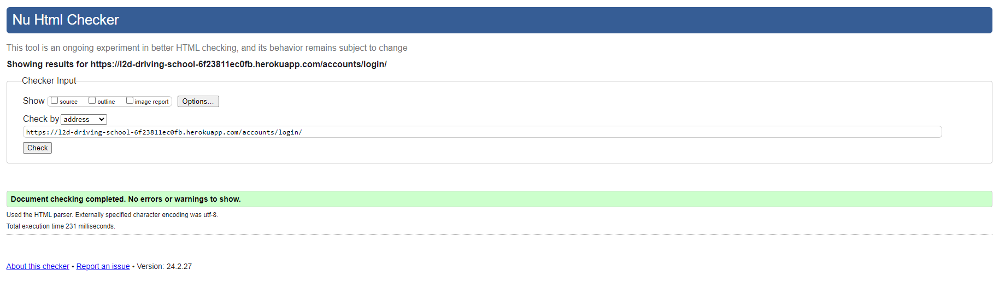 | Pass: No errors |
| Sign up | [W3C](https://validator.w3.org/nu/?doc=https%3A%2F%2Fl2d-driving-school-6f23811ec0fb.herokuapp.com%2Faccounts%2Fsignup%2F) |  | Pass: No errors |
| Password reset request form | [W3C](https://validator.w3.org/nu/?doc=https%3A%2F%2Fl2d-driving-school-6f23811ec0fb.herokuapp.com%2Faccounts%2Fpassword%2Freset%2F) |  | Pass: No errors |
| Password reset request confirmation | [W3C](https://validator.w3.org/nu/?doc=https%3A%2F%2Fl2d-driving-school-6f23811ec0fb.herokuapp.com%2Faccounts%2Fpassword%2Freset%2Fdone%2F) |  | Pass: No errors |
| Password reset form | [W3C](https://validator.w3.org/nu/?doc=https%3A%2F%2Fl2d-driving-school-6f23811ec0fb.herokuapp.com%2Faccounts%2Fpassword%2Freset%2Fkey%2F1b-set-password%2F) |  | Pass: No errors |
| Password reset confirmation | [W3C](https://validator.w3.org/nu/?doc=https%3A%2F%2Fl2d-driving-school-6f23811ec0fb.herokuapp.com%2Faccounts%2Fpassword%2Freset%2Fkey%2Fdone%2F) |  | Pass: No errors |
| Review Details (authenticated) | n/a |  | Pass: No Errors |
| User Profile (authenticated) | n/a |  | Pass: No errors |
| Appointments (authenticated) | n/a |  | Pass: No Errors |
| Profile (authenticated) | n/a |  | Pass: No Errors |
| Edit profile (authenticated) | n/a | 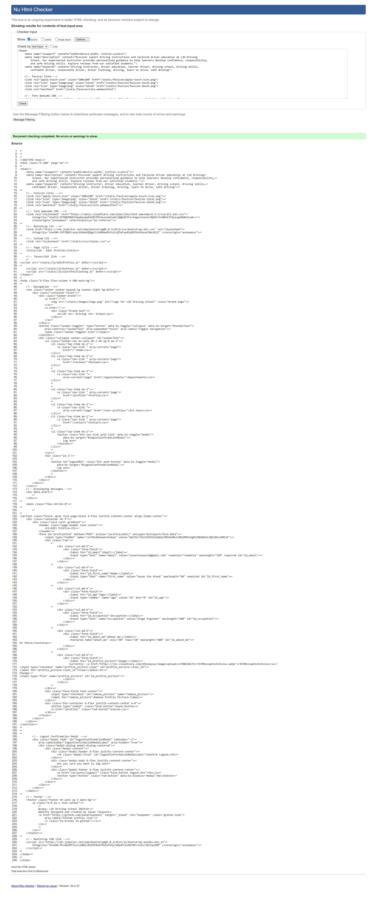 | Pass: No Errors |
| Create review (authenticated) | n/a |  | Pass: No Errors |
| Edit review (authenticated) | n/a |  | Pass: No Errors |
| Edit comment (authenticated) | n/a |  | Pass: No Errors |

### CSS

I have used the recommended [CSS Jigsaw Validator](https://jigsaw.w3.org/css-validator) to validate all of my CSS files.

| File | Jigsaw URL | Screenshot | Notes |
| --- | --- | --- | --- |
| styles.css | [Jigsaw](https://jigsaw.w3.org/css-validator/validator?uri=https%3A%2F%2Fl2d-driving-school-6f23811ec0fb.herokuapp.com%2Fstatic%2Fcss%2Fstyles.css&profile=css3svg&usermedium=all&warning=1&vextwarning=&lang=en) |  | Pass: No Errors |

### JavaScript

I have used the recommended [JShint Validator](https://jshint.com) to validate all of my JS files.

| File | Screenshot | Notes |
| --- | --- | --- |
| alertPositioning.js |  | Pass: No Errors |
| buttons.js |  | Pass: No Errors |
| disableSubmitButton.js |  | Pass: No Errors |
| editProfile.js |  | Pass: No Errors |
| overlay.js |  | Pass: No Errors |
| pagination.js |  | Pass: No Errors |

### Python

I have used the recommended [PEP8 CI Python Linter](https://pep8ci.herokuapp.com) to validate all of my Python files.

| File | CI URL | Screenshot | Notes |
| --- | --- | --- | --- |
| apps.py (core) | [PEP8 CI](https://pep8ci.herokuapp.com/https://raw.githubusercontent.com/SasanTazayoni/L2D-driving-school-CI-PP4/main/core/apps.py) |  | Pass: No Errors |
| urls.py (core) | [PEP8 CI](https://pep8ci.herokuapp.com/https://raw.githubusercontent.com/SasanTazayoni/L2D-driving-school-CI-PP4/main/core/urls.py) |  | Pass: No Errors |
| views.py (core) | [PEP8 CI](https://pep8ci.herokuapp.com/https://raw.githubusercontent.com/SasanTazayoni/L2D-driving-school-CI-PP4/main/core/views.py) |  | Pass: No Errors |
| admin.py (profiles) | [PEP8 CI](https://pep8ci.herokuapp.com/https://raw.githubusercontent.com/SasanTazayoni/L2D-driving-school-CI-PP4/main/profiles/admin.py) |  | Pass: No Errors |
| apps.py (profiles) | [PEP8 CI](https://pep8ci.herokuapp.com/https://raw.githubusercontent.com/SasanTazayoni/L2D-driving-school-CI-PP4/main/profiles/apps.py) |  | Pass: No Errors |
| forms.py (profiles) | [PEP8 CI](https://pep8ci.herokuapp.com/https://raw.githubusercontent.com/SasanTazayoni/L2D-driving-school-CI-PP4/main/profiles/forms.py) |  | Pass: No Errors |
| models.py (profiles) | [PEP8 CI](https://pep8ci.herokuapp.com/https://raw.githubusercontent.com/SasanTazayoni/L2D-driving-school-CI-PP4/main/profiles/models.py) | 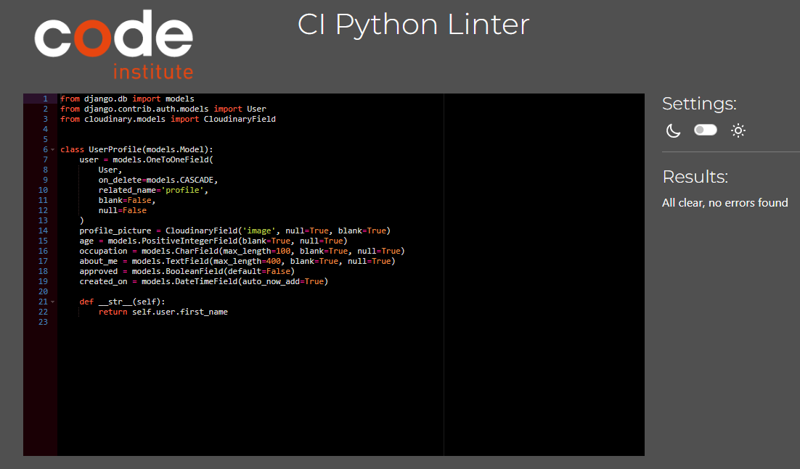 | Pass: No Errors |
| signals.py (profiles) | [PEP8 CI](https://pep8ci.herokuapp.com/https://raw.githubusercontent.com/SasanTazayoni/L2D-driving-school-CI-PP4/main/profiles/signals.py) |  | Pass: No Errors |
| urls.py (profiles) | [PEP8 CI](https://pep8ci.herokuapp.com/https://raw.githubusercontent.com/SasanTazayoni/L2D-driving-school-CI-PP4/main/profiles/urls.py) |  | Pass: No Errors |
| views.py (profiles) | [PEP8 CI](https://pep8ci.herokuapp.com/https://raw.githubusercontent.com/SasanTazayoni/L2D-driving-school-CI-PP4/main/profiles/views.py) |  | Pass: No Errors |
| admin.py (reviews) | [PEP8 CI](https://pep8ci.herokuapp.com/https://raw.githubusercontent.com/SasanTazayoni/L2D-driving-school-CI-PP4/main/reviews/admin.py) |  | Pass: No Errors |
| apps.py (reviews) | [PEP8 CI](https://pep8ci.herokuapp.com/https://raw.githubusercontent.com/SasanTazayoni/L2D-driving-school-CI-PP4/main/reviews/apps.py) |  | Pass: No Errors |
| forms.py (reviews) | [PEP8 CI](https://pep8ci.herokuapp.com/https://raw.githubusercontent.com/SasanTazayoni/L2D-driving-school-CI-PP4/main/reviews/forms.py) |  | Pass: No Errors |
| models.py (reviews) | [PEP8 CI](https://pep8ci.herokuapp.com/https://raw.githubusercontent.com/SasanTazayoni/L2D-driving-school-CI-PP4/main/reviews/models.py) |  | Pass: No Errors |
| urls.py (reviews) | [PEP8 CI](https://pep8ci.herokuapp.com/https://raw.githubusercontent.com/SasanTazayoni/L2D-driving-school-CI-PP4/main/reviews/urls.py) |  | Pass: No Errors |
| views.py (reviews) | [PEP8 CI](https://pep8ci.herokuapp.com/https://raw.githubusercontent.com/SasanTazayoni/L2D-driving-school-CI-PP4/main/reviews/views.py) |  | Pass: No Errors |
| settings.py (l2d) | [PEP8 CI](https://pep8ci.herokuapp.com/https://raw.githubusercontent.com/SasanTazayoni/L2D-driving-school-CI-PP4/main/l2d/settings.py) |  | Pass: No Errors |
| urls.py (l2d) | [PEP8 CI](https://pep8ci.herokuapp.com/https://raw.githubusercontent.com/SasanTazayoni/L2D-driving-school-CI-PP4/main/l2d/urls.py) |  | Pass: No Errors |

## Browser Compatibility

I've tested my deployed project on multiple browsers to check for compatibility issues.

| Browser | Screenshot | Notes |
| --- | --- | --- |
| Chrome |  | Works as expected |
| Edge |  | Works as expected |
| Firefox |  | Works as expected |

I have also used PowerMapper as a tool to check the compatibility of the website on multiple browsers and it has proven that it works on all of the most commonly used devices:

To access the report:
* Click [this link](https://try.powermapper.com/Demo/Report/d05da195-b9dc-4ecc-bebe-d7f9ce883157).
* Click the "Issues" button at the top.
* Click the compatibility tab.

## Responsiveness

I've tested every page on my deployed project on multiple devices to check for responsiveness issues. The reviews page will be used as an example to demonstrate the responsiveness.

| Device | Screenshot | Notes |
| --- | --- | --- |
| desktop |  | Works as expected |
| iPhone-SE |  | Works as expected |
| iPhone-XR |  | Works as expected |
| iPhone-12-Pro |  | Works as expected |
| iPhone-14-Pro-Max |  | Works as expected |
| Pixel-7 |  | Works as expected |
| Samsung-Galaxy-S8+ |  | Works as expected |
| Samsung-Galaxy-S20-Ultra |  | Works as expected |
| iPad-Mini |  | Works as expected |
| iPad-Air |  | Works as expected |
| iPad-Pro |  | Works as expected |
| Surface-Pro-7 |  | Works as expected |
| Surface-Duo |  | Works as expected |
| Galaxy-Fold |  | Works as expected |
| Asus-Zenbook-Fold |  | Works as expected |
| Samsung-Galaxy-A51-71 |  | Works as expected |
| Nest-Hub |  | Works as expected |
| Nest-Hub-Max |  | Works as expected |

## Lighthouse Audit

I've tested my deployed project using the Lighthouse Audit tool to check for any major issues.

| Page | Mobile | Desktop | Notes |
| --- | --- | --- | --- |
| Home |  |  | No significant warnings |
| Reviews |  |  | Warnings about the use of Cloudinary cookies |
| Review details |  |  | Warnings about the use of Cloudinary cookies |
| Appointments |  |  | Slow loading because of Calendly, warnings about the use of Calendly cookies |
| Profile | 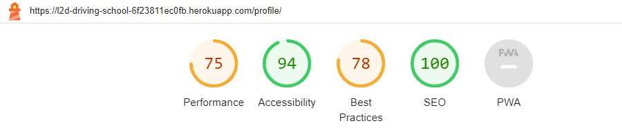 |  | Warnings about the use of Cloudinary cookies, slow response time due to large image |
| Edit profile |  |  | Warnings about the use of Cloudinary cookies |
| Edit review |  |  | No significant warnings |
| User profiles |  |  | Warnings about the use of Cloudinary cookies, slow response time due to large images |
| User profile |  |  | Warnings about the use of Cloudinary cookies |
| Contact |  |  | Warnings about the use of Google maps cookies, slower loading on mobile due to map resizing |
| Sign up |  |  | Warning about visibility of link on mobile view |
| Log in |  |  | Warning about visibility of links on mobile view |
| Password reset request |  |  | No significant warnings |
| Password reset request confirmation |  |  | No significant warnings |
| Password reset |  |  | No significant warnings |
| Password reset confirmation |  |  | Warning about visibility of link on mobile view |

## Defensive Programming

Defensive programming was manually tested with the below user acceptance testing:

| Page | User Action | Expected Result | Pass/Fail | Comments |
| --- | --- | --- | --- | --- |
| All pages | | | | |
| | Click on logo | Redirection to Home page | Pass | |
| | Click on logo text | Redirection to Home page | Pass | |
| | If the user is authenticated | "Log out" button and the "Profile" link appears in the navigation bar | Pass | |
| | If the user is not authenticated | "Log in/Sign up" button appears in the navigation bar and the "Profile" link and "Appointments" link are not available | Pass | |
| | User profile is approved by admin | "Appointments" link appears in the navigation bar | Pass | |
| Home | | | | |
| | Non-authenticated users | The buttons "Sign up" and "Reviews" appear | Pass | |
| | Click on "Home" link in the navigation bar | User will be redirected to the home page | Pass | |
| | Click the "Sign up" button | Redirects user to sign up form | Pass | |
| | Click the "Reviews" button | Redirects user to reviews page | Pass | |
| | Authenticated users | The buttons "Reviews" and "Contact" appear | Pass | |
| | Click the "Contact" button | Redirects user to contact page | Pass | |
| | Authenticated users that are approved | The buttons "Schedule" and "Contact" appear | Pass | |
| | Click the "Schedule" button | Redirects user to appointments page | Pass | |
| Reviews | | | | |
| | Click on "Reviews" link in the navigation bar | User will be redirected to the reviews page | Pass | |
| | Click on a review card | Redirects user to review details page | Pass | |
| | Click on the pagination number | Shows a set of review cards according to the page number | Pass | |
| Review details | | | | |
| | Click on a review card on the "Reviews" page | Redirects user to review details page | Pass | |
| | If the user has made a review, click on the "View details" link | Redirects to the review details page | Pass | |
| | Click on the author's name on the review details page | Redirects user to the author's profile | Pass | |
| | Add like if user has not given a like already | Like count increases | Pass | The heart icon shows as red if the user has liked already and an outline if they have not |
| | Remove like if user has given a like already | Like count decreases | Pass | The heart icon shows as red if the user has liked already and an outline if they have not |
| | As an authenticated user click "Edit review" button (available if it is your review) | User redirected to review form | Pass | |
| | As an authenticated user click "Delete review" button (available if it is your review) | Modal pops up | Pass | |
| | After clicking "Delete review", click the "No" button on the modal that pops up | Closes the modal | Pass | |
| | After clicking "Delete review", click off the modal that pops up | Closes the modal | Pass | |
| | After clicking "Delete review", click the "Yes" button on the modal that pops up | The review and all comments on it will be deleted | Pass | |
| | As an authenticated user click "Edit comment" button (available if it is your comment) | User redirected to edit comment form | Pass | |
| | As an authenticated user click "Delete comment" button (available if it is your comment) | Modal pops up | Pass | |
| | After clicking "Delete comment", click the "No" button on the modal that pops up | Closes the modal | Pass | |
| | After clicking "Delete comment", click off the modal that pops up | Closes the modal | Pass | |
| | After clicking "Delete comment", click the "Yes" button on the modal that pops up | The comment will be deleted | Pass | |
| | As an authenticated user click the "Submit" button with an empty Comments form | User will be prompted to fill the form and it will not be submitted | Pass | |
| | As an authenticated user click the "Submit" button with content in the Comments form | The form will be submitted for approval and a django message will appear | Pass | |
| | Brute forcing the review details URL when not authenticated in order to add a comment | The review detail page will be shown as it should for an unauthenticated user and a django message will appear | Pass | |
| Appoinments | | | | |
| | As an authenticated user that has been approved by the admin click on "Apppointments" link in the navigation bar | User will be redirected to the appointments page | Pass | |
| | As an authenticated user that has been approved by the admin, access Calendly | User can manage their appointments | Pass | |
| | Brute forcing the appointments URL when not authenticated | User redirected to login page | Pass | |
| | Brute forcing the appointments URL when authenticated but not approved | User redirected to contact page and a django message appears | Pass | |
| Profile | | | | |
| | As an authenticated user click on "Profile" link in the navigation bar | User will be redirected to their profile page | Pass | |
| | Click "Edit profile" button | User redirected to edit profile form | Pass | |
| | Click "Delete profile" button | Modal pops up | Pass | |
| | After clicking "Delete profile", click the "No" button on the modal that pops up | Closes the modal | Pass | |
| | After clicking "Delete profile", click off the modal that pops up | Closes the modal | Pass | |
| | After clicking "Delete profile", click the "Yes" button on the modal that pops up | The profile gets removed from the database including the review (if it was made) and any comments by the user | Pass | |
| | Click "View details" link | User redirected to review details of their review | Pass | |
| | Click "Edit review" button | User redirected to review form | Pass | |
| | Click "Delete review" button | Modal pops up | Pass | |
| | After clicking "Delete review", click the "No" button on the modal that pops up | Closes the modal | Pass | |
| | After clicking "Delete review", click off the modal that pops up | Closes the modal | Pass | |
| | After clicking "Delete review", click the "Yes" button on the modal that pops up | The review and all comments on it will be deleted | Pass | |
| | Click "Review by (username)" link | User redirected to review by respective user | Pass | |
| | Click "Edit comment" button | User redirected to edit comment form | Pass | |
| | Click "Delete comment" button | Modal pops up | Pass | |
| | After clicking "Delete comment", click the "No" button on the modal that pops up | Closes the modal | Pass | |
| | After clicking "Delete comment", click off the modal that pops up | Closes the modal | Pass | |
| | After clicking "Delete comment", click the "Yes" button on the modal that pops up | The comment will be deleted | Pass | |
| | Brute forcing the profile URL when not authenticated | User redirected to login page | Pass | |
| Edit profile | | | | |
| | Click "Edit profile" button on the profile page | User redirected to edit profile form | Pass | |
| | Attempt to edit profile and click the "Submit" button | All fields can be edited except the email and will be changed | Pass | |
| | Add a different picture and click the "Submit" button | User picture will change | Pass | |
| | Click "Remove picture" checkbox and click the "Submit" button | User picture is removed | Pass | |
| | Click "Cancel" button | User redirected to profile | Pass | |
| | Brute forcing the edit profile URL when not authenticated | User redirected to login page | Pass | |
| Edit review | | | | |
| | Click "Edit review" button on the profile page or on the review detail page (available if it is your review) | User redirected to review form | Pass | |
| | Attempt to edit review and click the "Save" button with blank field | User prompted to fill out form and form is not submitted | Pass | |
| | Attempt to edit review and click the "Save" with correct fields | The fields will be changed | Pass | |
| | Brute forcing the edit review URL when not authenticated | User redirected to login page | Pass | |
| User profiles | | | | |
| | Click on the "User profiles" link | User will be redirected to the user profiles page | Pass | |
| | Click on the "Search" button with no entry | User will be prompted to enter an input and the form will not be submitted | Pass | |
| | Click on the "Search" button with an entry | The search will return a paginated list of users, if the search finds nothing then it will display a message | Pass | |
| | Click on the "Show all" button | Shows all users in a paginated gallery | Pass | |
| | Click on the user profile thumbnail | Redirects to the respective user's profile | Pass | |
| | Click on the pagination number | Shows a set of user profiles according to the page number | Pass | |
| User profile | | | | |
| | Click on the user profile thumbnail on the user profiles page | Redirects to the respective user's profile | Pass | |
| | Non-authenticated users | The button "All users" apeears | Pass | |
| | Click the "All users" button | Redirects user to the all users page | Pass | |
| | Authenticated users | The buttons "All users" and "My profile" appear | Pass | |
| | Click the "My profile" button | Redirects user to their profile page | Pass | |
| | If the user has made a review, click on the "View details" link | Redirects to the review details page | Pass | |
| Contact | | | | |
| | Click on "Contact" link in the navigation bar | User will be redirected to the contact page | Pass | |
| | Click on the "Submit" button with form fields that do not meet the minimum validation requirements | User will be prompted to fill the form correctly and the form will nt submit | Pass | |
| | Click on the "Submit" button with an invalid email but other fields filled correctly | User redirected to Formspree which states that the email needs to be valid and the form does not submit | Pass | |
| | Click on the "Submit" button with fields filled correctly | Form is processed by Formspree and submitted | Pass | |
| | Click on the "Clear" button | Clears all form fields | Pass | |
| Login | | | | |
| | When not authenticated, click on the "Log in/Sign up" button on the navigation bar | User will be redirected to the login page | Pass | |
| | Click on the "Forgot your password?" link | User will be redirected to the password reset request form | Pass | |
| | Click on the "Sign up here" link | User will be redirected to the sign up form | Pass | |
| | Click on the "Reset" button | Clears the form fields | Pass | |
| | Click on the "Log in" button with empty fields | Gives an error message and prevents the user from logging in | Pass | |
| | Click on the "Log in" button with incorrect credentials | Gives an error message and prevents the user from logging in | Pass | |
| | Click on the "Log in" button with correct credentials | Logs the user in and shows a django message | Pass | Redirects to the home page |
| | Authenticated users cannot access the "Log in/Sign up" button | "Log out" button appears instead of the "Log in/Sign up" button | Pass | |
| | When authenticated, brute forcing the URL to get to the login page | Redirects to home page | Pass | |
| Logout | | | | |
| | When authenticated, click the "Log out" button | A modal pops up | Pass | |
| | After clicking "Log out", click the "No" button on the modal that pops up | Closes the modal | Pass | |
| | After clicking "Log out", click off the modal that pops up | Closes the modal | Pass | |
| | After clicking "Log out", click the "Yes" button on the modal that pops up | Logs out the user and displays a django message | Pass | Redirects user to home page |
| | Non-authenticated users cannot access the "Log out" button | "Log in/Sign up" button appears instead of the "Log out" button | Pass | |
| | Brute forcing the logout URL when not authenticated | Redirects user back to home page | Pass | |
| Sign up | | | | |
| | When not authenticated, click on the "Log in/Sign up" button on the navigation bar and then the "Sign up here" link on the login form | User will be redirected to the sign up page | Pass | |
| | Click on the "Log in here" link | User will be redirected to the login form | Pass | |
| | Click on the "Reset" button | Clears the form fields | Pass | |
| | Click on the "Sign up" button with empty fields | Gives error messages and prevents the user from signing up | Pass | |
| | Click on the "Sign up" button without meeting the minimum requirements of the form | Gives error messages for each respective field and prevents the user from signing up | Pass | |
| | Click on the "Sign up" button using the email and/or username of an existing account | Gives error messages and prevents the user from signing up | Pass | |
| | Click on the "Sign up" button with correct inputs | Signs the user up, creates an account and shows a django message | Pass | Redirects to edit profle page |
| | Authenticated users cannot access the "Log in/Sign up" button | "Log out" button appears instead of the "Log in/Sign up" button | Pass | |
| | When authenticated, brute forcing the URL to get to the sign up page | Redirects to home page | Pass | |
| Password reset request | | | | |
| | Click on the "Forgot your password?" link | User will be redirected to the password reset request form | Pass | |
| | Click on the "Cancel request" button | User will be redirected to the login page | Pass | If the user is authenticated they are redirected to the home page |
| | Click on the "Reset password" button with an empty field | User is prompted to fill out the field and the form does not submit | Pass | |
| | Click on the "Reset password" button with a valid email format | Email is sent to the input email | Pass | If the email exists in the database it receives a token to reset the password, if the email does not exist nothing happens but the user is intentionally not notified as a security measure |
| | Brute forcing the URL to get to another user's profile | User should be given an error | Pass | Redirects user back to own profile |
| Password reset request confirmation | | | | |
| | Entering a valid email format in the password request reset form | User will be redirected to the password reset request confirmation page | Pass | |
| Password reset | | | | |
| | Click on the token (link) provided in the email after requesting a password reset | User will be redirected to the password reset form | Pass | |
| | Click on the "Clear" button | Clears all form fields | Pass | |
| | Click on the "Submit" with empty fields | Gives an error and the form does not submit | Pass | |
| | Click on the "Submit" with mismatched passwords or passwords that do not meet the minimum criteria | Gives an error and the form does not submit | Pass | |
| | Click on the "Submit" with matched passwords that meet the criteria | Changes the users password associated with the email | Pass | |
| | Brute forcing the URL to get to password reset form | The form does not have access to a token that links a user account therefore updating the password is redundant | Pass | |
| Password reset confirmation | | | | |
| | Resetting the password correctly using a token (via email) | Redirects to the password reset confirmation page | Pass | |
| | Click on the "log in" link | Redirects user to the login page | Pass | |

## User Story Testing

| User Story | Screenshot |
| --- | --- |
| As a new site user I can register and establish an account on the site so that I can create a personalised profile. |  |
| As a registered user I can log in to my account to actively participate in the site's community, engaging with reviews and managing my appointments so that I can enhance my user experience and stay organised with scheduled appointments. | 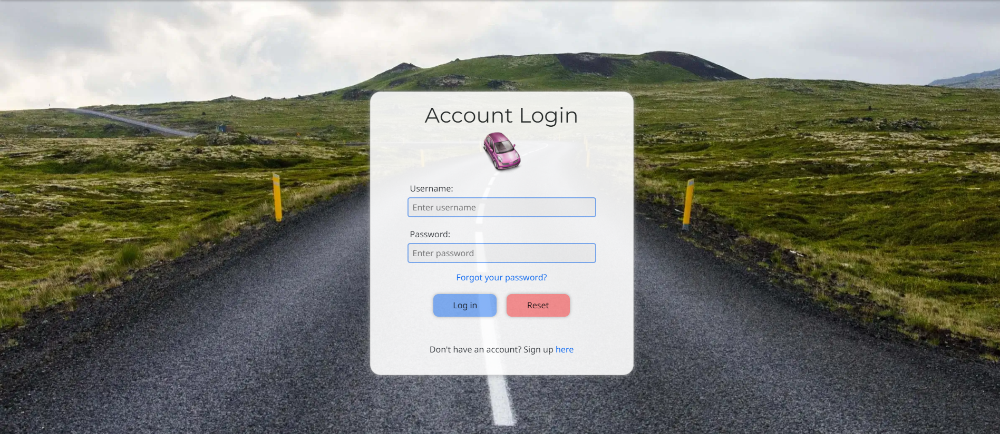 |
| As a registered user I can log out of my account so that I can end my session on my current device. |  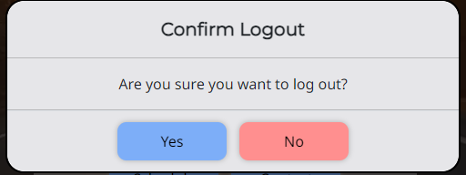 |
| As a registered user/site admin I can reset my password if I forget it so that I can regain access to my account. |  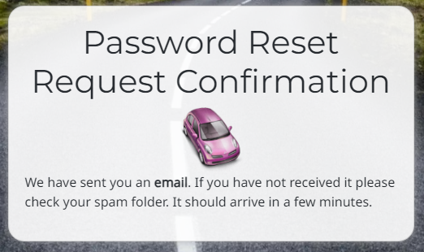 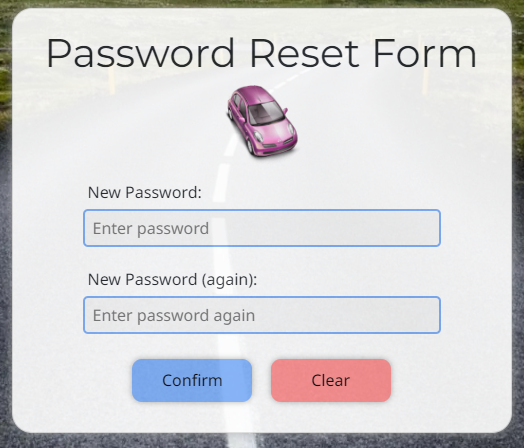 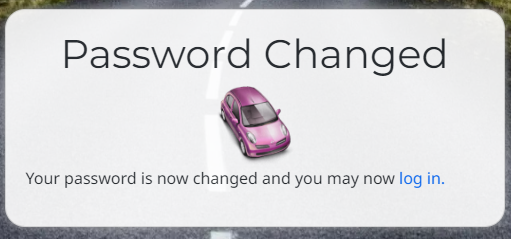 |
| As a registered user I can view my profile details so that I can see the personal information I have provided. |  |
| As a registered user I can customise my profile settings so that I can tailor my online experience to reflect my personality. |  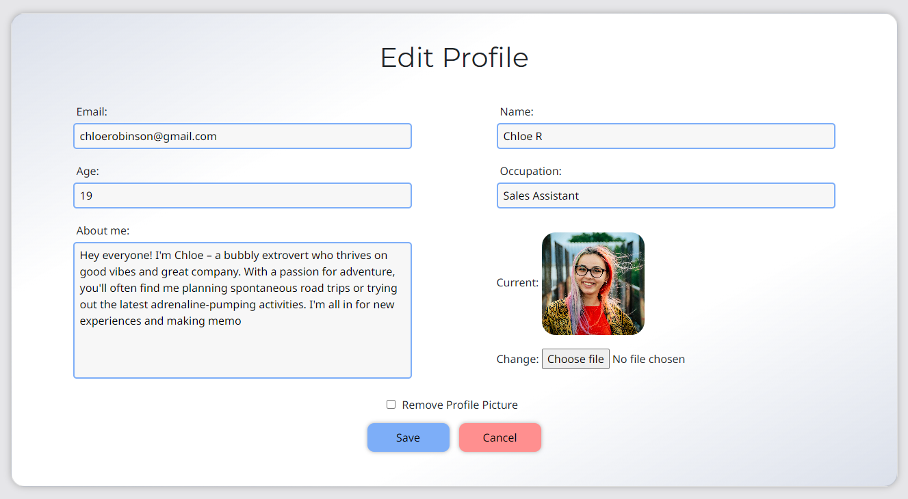 |
| As a registered user I can delete my account so that my personal information and account data are permanently removed from the system. |   |
| As a registered user I can schedule a new driving lesson by selecting a preferred time and date so that I can efficiently plan and manage my appointments with the driving instructor. |  |
| As a registered user I can view my scheduled appointments so that I can keep track of my upcoming driving lessons and manage my time effectively. |  |
| As a registered user I can edit the details of my booked appointment so that I can make necessary adjustments to the time or date, ensuring my driving lessons align with my schedule. |  |
| As a registered user I can delete a scheduled appointment so that I can remove appointments that are no longer needed, ensuring an accurate and up-to-date schedule. |  |
| As a registered user I can create a new review which provides a rating and a description so that I can share my experience and contribute valuable feedback to the community. |   |
| As a new site user I can register and establish an account on the site so that I can create a personalised profile. |   |
| As a site user I can access and read the full content of an individual review so that I can stay informed about the discussions and experiences shared within the community. | 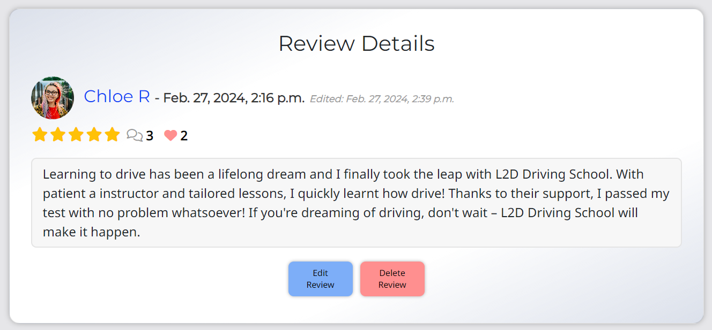 |
| As a registered user I can edit my reviews so that I can refine and update my thoughts and feedback as needed. |  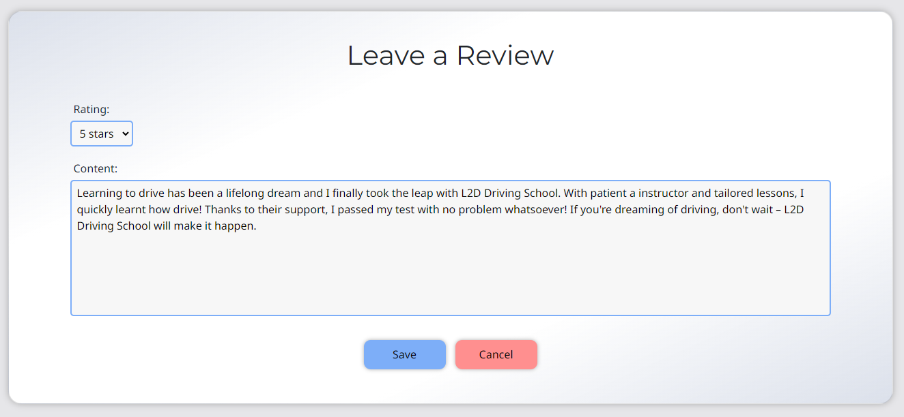 |
| As a registered user I can delete my own reviews so that I have control over the content I contribute to the community. |  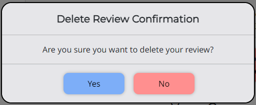 |
| As a site user I can view the timestamp of a review so that I can understand the context and relevance of the content based on its creation time and date. |  |
| As a site user I can view the timestamp of a review that has been edited so that I can track when changes were made and assess the credibility and relevance of the review's content over time. |  |
| As a registered user I can comment on existing reviews so that I can actively engage with other members who have shared their experience. |  |
| As a site user I can access comments on reviews by simply clicking on the respective review so that I can engage with and further explore the insights and discussions within the community. | 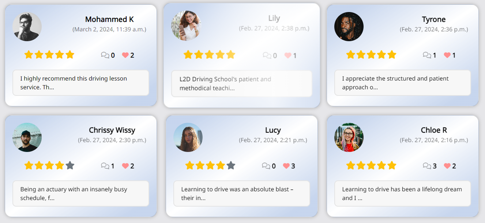  |
| As a registered user I can edit my comments on reviews that I have previously made so that I can keep my contributions up-to-date and relevant. |  |
| As a registered user I can delete my comments on another person's review as well as my own so that I can manage and control the content associated with my profile, removing comments as needed for relevance or appropriateness. |   |
| As a site user I can view the timestamp of a comment so that I can understand the context and relevance of the content based on its creation time and date. |  |
| As a new site user I can navigate through the interface effortlessly so that I can quickly and easily find the information I need. |  |
| As a site user I can read about the driving instructor so that I can learn about their experience and teaching approach, helping me make informed decisions about booking driving lessons. |  |
| As a new site user I can view the driving instructor's experience and ratings so that I can make an informed decision about choosing a qualified and well-rated instructor for my driving lessons. | 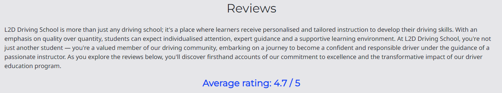 |
| As a a site user I can view a paginated list of reviews so that I can select which review I want to view in more detail. |  |
| As a site user I can browse a paginated gallery of other users so that I can discover fellow members of the platform community. |  |
| As a site user I can I can view other user profiles so that I can learn more about their background and offerings which helps me make informed decisions when engaging with their content. |  |
| As a site administrator I can delete/update/approve reviews and comments from any user so that I can maintain the integrity of the platform. |  |
| As a registered user I can unlike reviews so that I can adjust my preferences and ensure the accuracy of my endorsements. |  |
| As a registered user I can like another person's review so that I can let them know I appreciate their post. | 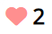 |
| As a new site user I can easily find and access the driving instructor's contact information so that I can get in touch for inquiries or assistance. | 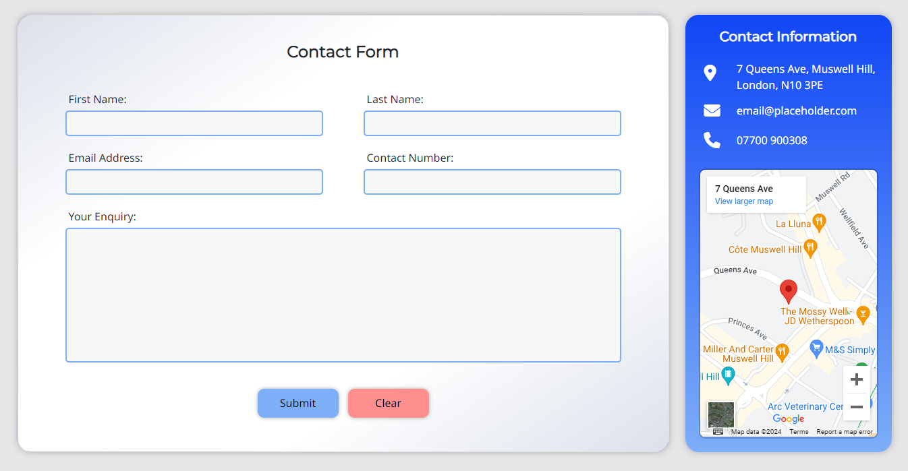 |
| As a new site user I can comprehend the website's purpose at a glance so that I can determine if the platform aligns with my needs and interests. |  |

The following are user stories I wasn't able to implement and have labeled as "Won't Have" in my MoSCoW prioritisation:

| User Story | Screenshot |
| --- | --- |
| As a registered user I can receive notifications for likes, comments and mentions on my reviews so that I can stay informed and promptly engage with the community's responses to my content. | N/A |
| As a site user I can customise the theme and appearance of the website so that it suits my preferences. | N/A |

## Automated Testing

I have conducted a series of automated tests on my application.

I fully acknowledge and understand that, in a real-world scenario, an extensive set of additional tests would be more comprehensive.

### Python (Unit Testing)

I have used Django's built-in unit testing framework to test the application functionality.

In order to run the tests, I ran the following command in the terminal:

`python3 manage.py test`

## Bugs

All bugs were solved during the process of creating the project and there are not any existing bugs that I am aware of.
